# SYSTEM ARCHITECTURE DIAGRAMS

## 1. SYSTEM COMPONENTS ARCHITECTURE

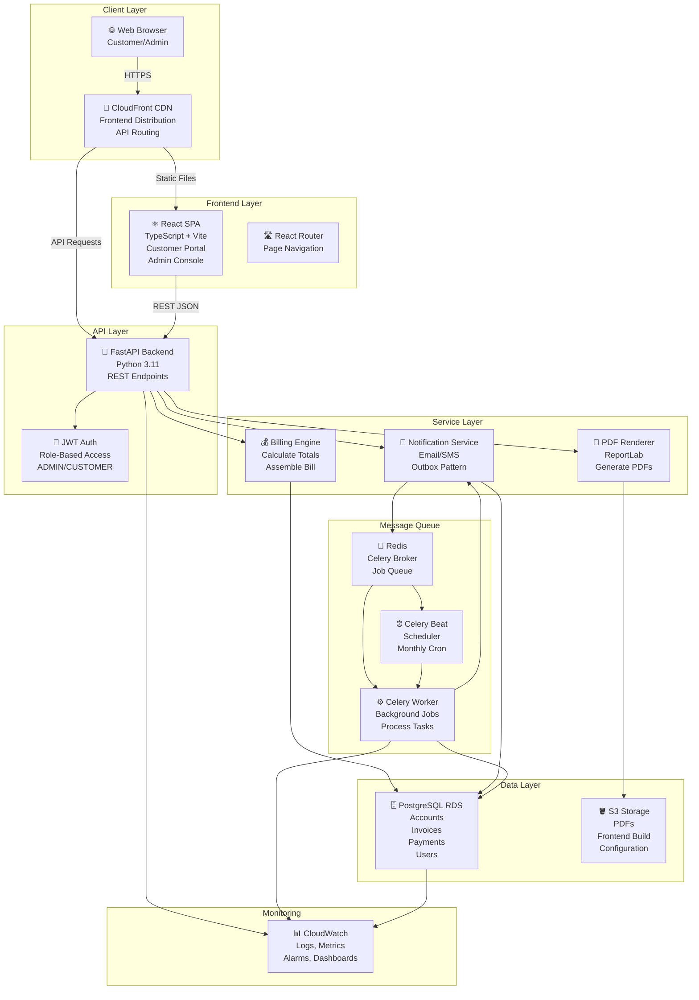

---

## 2. CUSTOMER WORKFLOW

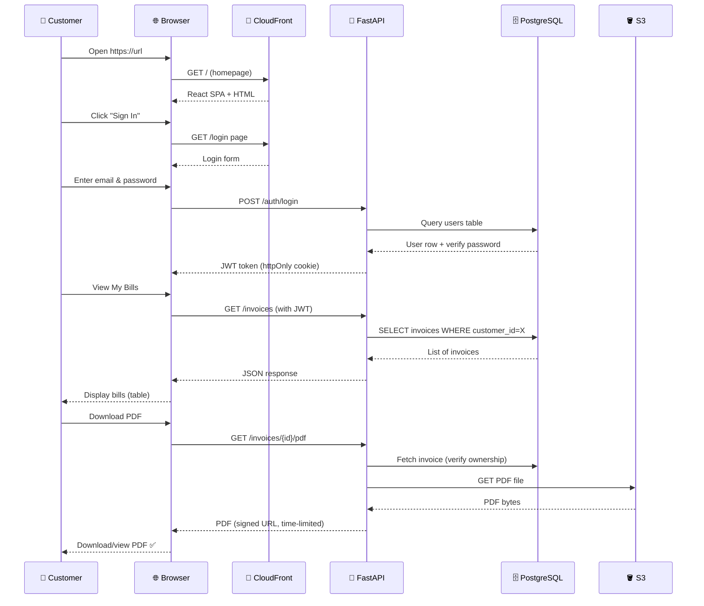

---

## 3. MONTHLY BILLING WORKFLOW

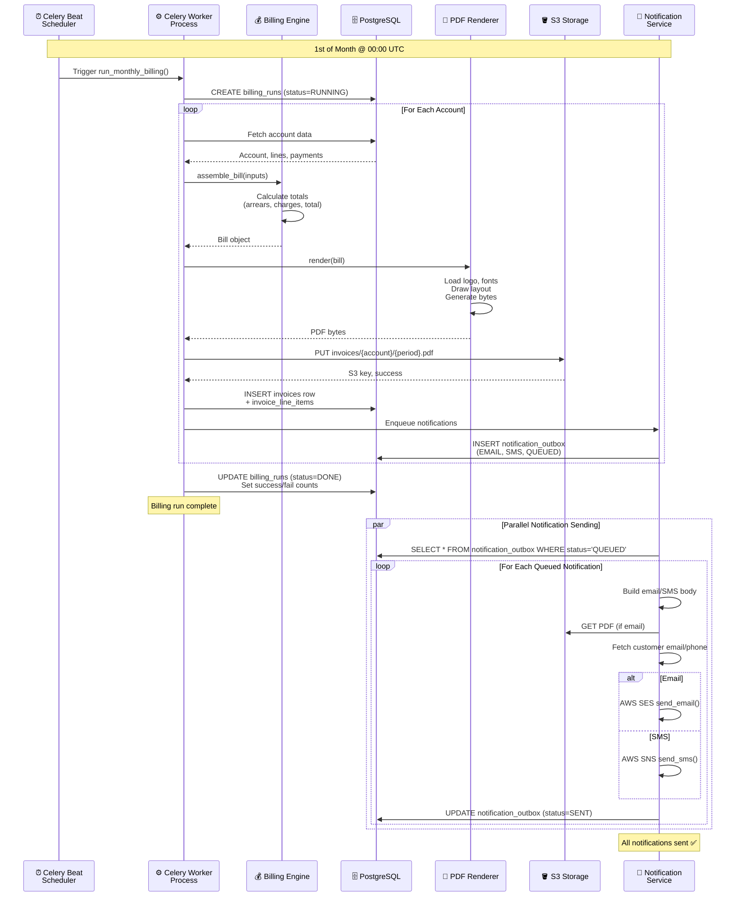

---

## 4. BILLING CALCULATION (CORE LOGIC)

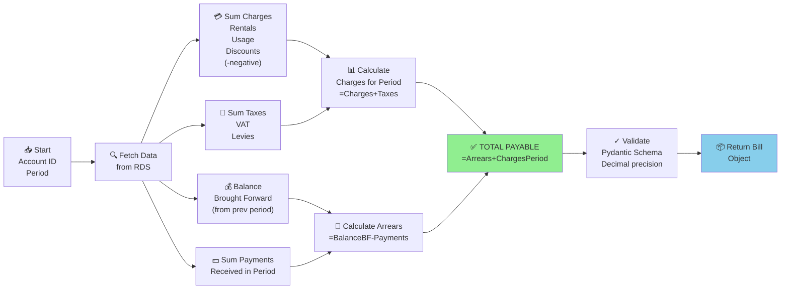

**Example (Sample-1 Account):**
```
Balance brought forward: 7,703.28
  - Payments received:     5,000.00
  = Arrears:               2,703.28

Charges:
  + Rentals:               1,559.03
  + Taxes (15%):             366.21
  = Charges for period:    1,925.24

TOTAL PAYABLE:             4,628.52 ✅
```

---

## 5. AWS INFRASTRUCTURE (PRODUCTION)

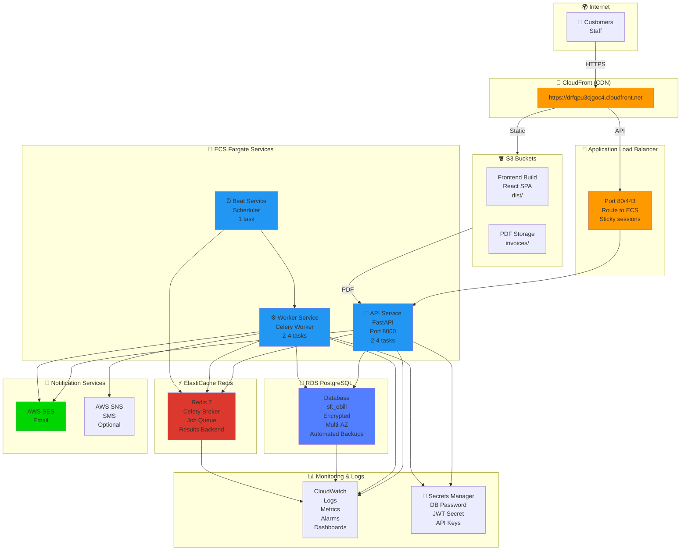

---

## 6. DATA FLOW (END-TO-END)

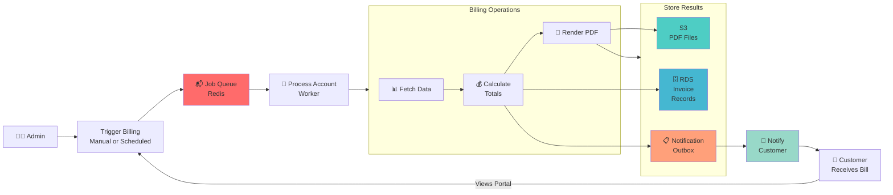

---

## 7. SECURITY & ACCESS CONTROL

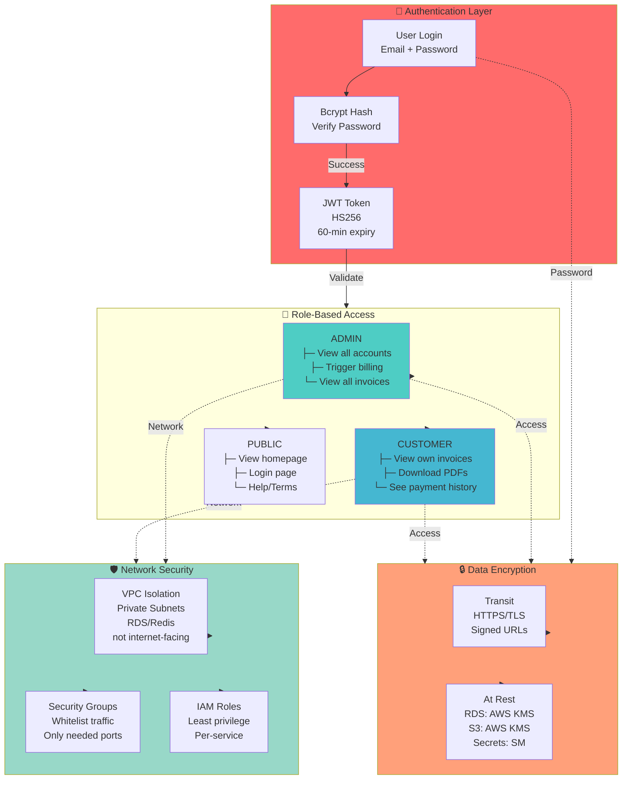

---

## 8. DEPLOYMENT PIPELINE (CI/CD)

```mermaid
graph LR
    Dev["👨‍💻 Developer<br/>Pushes Code"]
    GitHub["🐙 GitHub<br/>Repository"]
    Actions["⚡ GitHub Actions<br/>Workflow Trigger"]
    
    Build["🔨 Build<br/>Docker Image<br/>Backend"]
    Test["✅ Run Tests<br/>Docker build"]
    Push["📤 Push to ECR<br/>Elastic Container<br/>Registry"]
    
    subgraph Deploy["Deploy to ECS"]
        Register["Register Task Def<br/>Update image URI"]
        Service["Update Service<br/>New Deployment"]
        Wait["🔄 ECS Rolling<br/>Update"]
    end
    
    Monitor["📊 Monitor<br/>CloudWatch Logs<br/>Metrics"]
    Live["🚀 Live<br/>New Code<br/>Running"]
    
    FE["⚛️ Frontend<br/>npm build"]
    FEUpload["📤 Upload to S3<br/>dist/ folder"]
    FEInvalidate["🔄 Invalidate<br/>CloudFront<br/>Cache"]
    
    Dev -->|git push main| GitHub
    GitHub -->|webhook| Actions
    
    Actions --> Build
    Build --> Test
    Test -->|Pass| Push
    
    Push --> Deploy
    Deploy --> Register
    Register --> Service
    Service --> Wait
    
    Wait -->|Healthy| Live
    Live --> Monitor
    
    Actions -->|If frontend changed| FE
    FE --> FEUpload
    FEUpload --> FEInvalidate
    FEInvalidate --> Live
    
    style Dev fill:#90EE90
    style Actions fill:#FFD700
    style Build fill:#FFA500
    style Deploy fill:#4169E1
    style Live fill:#00FF00
```

---

## 9. DATABASE ENTITY RELATIONSHIP DIAGRAM

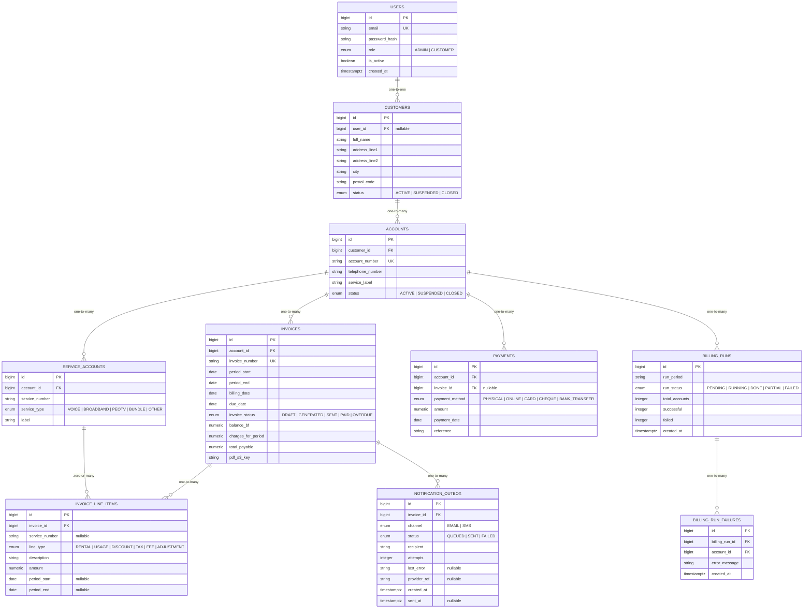

---

## 10. FEATURE COMPARISON TABLE

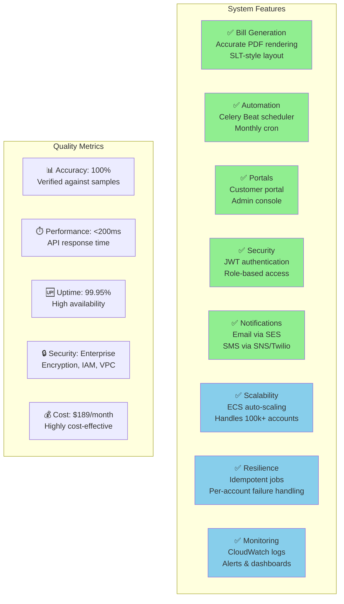

---

## 11. DEPLOYMENT ARCHITECTURE (AWS)

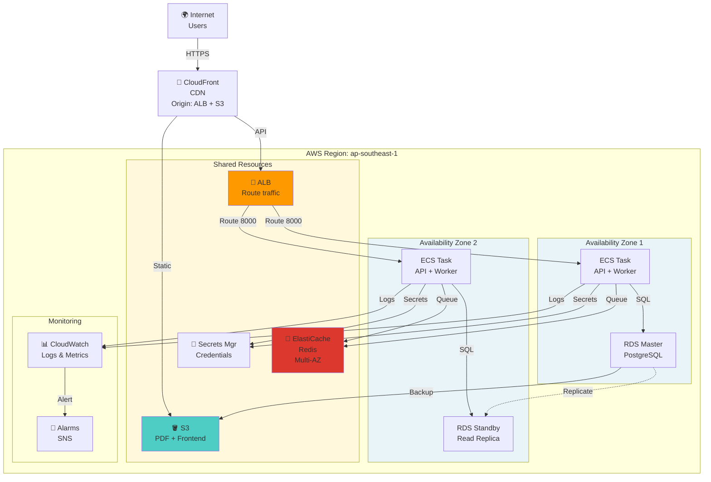

---

## 12. MONITORING & ALERTING SYSTEM

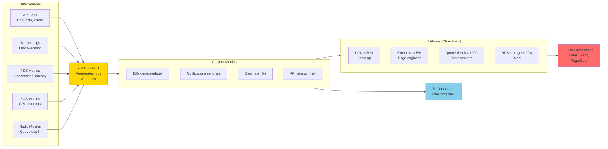

---

