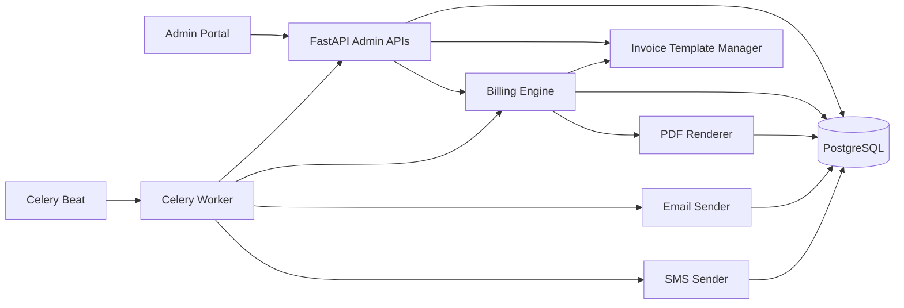
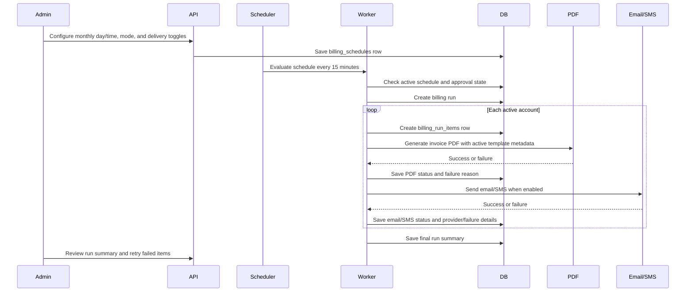

# Admin Portal Expansion Plan

## Current System Understanding

- Backend is FastAPI with SQLAlchemy ORM, Alembic migrations, PostgreSQL, ReportLab PDF generation, Celery Beat/Celery workers, Redis-backed scheduling, and notification sender abstractions.
- Frontend is React, TypeScript, Vite, Tailwind CSS, shadcn-style UI primitives, TanStack Query, and role-protected admin/customer routes.
- JWT login, admin/customer role checks, customer portal routes, invoice ownership checks, signed PDF token flow, billing formulas, and deployment files remain unchanged.
- The expansion scope is admin/backend-admin only.
- The system now supports demo-scale verification with exactly 100 seeded customers while keeping the data model suitable for much larger monthly SLT billing runs.

## Architecture Diagram

## Monthly Billing Workflow

## Implemented Admin Features

- Billing schedule settings:
  - Admin can configure monthly day, time, timezone, active flag, automatic/approval-required mode, approval lead days, approval email, and email/SMS delivery toggles.
  - Default schedule is day 1 at 02:00 in `Asia/Colombo`.
  - Celery Beat evaluates the schedule every 15 minutes.

- Approval mode:
  - Approval-required schedules create a `billing_run_approvals` request during the approval window.
  - Admin can approve or reject pending approval requests from the admin billing page.
  - Expired pending approvals are marked as expired by the evaluator.

- Billing run dashboard:
  - Admin can generate a preview batch, inspect every account row, and then explicitly Confirm Send.
  - Run summary includes period, template, total, PDF success/failure counts, email status counts, SMS status counts, and run status.
  - Run detail rows include account number, customer name, phone, email, PDF status, email status, SMS status, overall status, failure reason, invoice link, and retry action.

- Manual retry:
  - Admin can retry a single billing run item.
  - Retry regenerates the invoice PDF and optionally attempts email/SMS delivery using the current schedule toggles.

- Admin customer detail:
  - Admin customer detail now shows customer contact details plus linked account number, telephone number, service label, status, and billing cycle.
  - Customer portal features were not expanded.

- Invoice template management:
  - 18 system templates are seeded with codes `SLT_TEMPLATE_01` through `SLT_TEMPLATE_18`.
  - One template is active globally.
  - Admin can activate a template, edit metadata, Save as Copy, or Save as Original with confirmation.
  - PDF rendering keeps the existing layout as default and applies optional template metadata for header, footer, promotion message, theme name, and theme color.

- Demo seed data:
  - Existing hand-seeded customers are preserved.
  - Realistic demo profiles are preserved.
  - Additional deterministic customers are added until the total seeded customer count is exactly 100.
  - Muhammad Hamdhi is included with email `hamdhimuhammad024@gmail.com` and mobile `0774991051`.

## Database Changes

- `invoice_templates`
  - Stores 18 system templates and custom copies.
  - Includes name, description, template code, active flag, system/custom flag, base template ID, messages, theme settings, and timestamps.

- `billing_run_items`
  - Stores one row per account processed in a billing run.
  - Tracks PDF, email, SMS, and overall status with PostgreSQL enums.
  - Stores account/customer/invoice/template references, retry count, provider references, and failure reasons.

- `billing_schedules`
  - Stores monthly billing day/time, timezone, mode, active flag, delivery toggles, approval settings, and last triggered period.

- `billing_run_approvals`
  - Stores approval-required schedule requests, status, admin decision, notes, expiry, and optional linked run.

- Existing compatibility:
  - `billing_run_failures` is preserved for older summary behavior.
  - `billing_runs.template_id` and `invoices.template_id` are nullable so existing invoices render with the default behavior.

## Backend API Changes

- Billing schedule:
  - `GET /billing/schedule`
  - `PUT /billing/schedule`
  - `POST /billing/schedule/evaluate`
  - `GET /billing/schedule/approvals`
  - `POST /billing/schedule/approvals/{approval_id}/approve`
  - `POST /billing/schedule/approvals/{approval_id}/reject`

- Billing generation and delivery:
  - `POST /billing/generate-batch` creates run items and can optionally send notifications.
  - `GET /billing/runs` lists enriched run summaries.
  - `GET /billing/runs/{id}` returns enriched run details.
  - `POST /billing/runs/{id}/send` attempts delivery for generated invoices.
  - `POST /billing/run-items/{item_id}/retry` retries one account row.

- Templates:
  - `GET /invoice-templates`
  - `GET /invoice-templates/{id}`
  - `POST /invoice-templates/{id}/activate`
  - `GET /invoice-templates/{id}/preview`
  - `POST /invoice-templates/{id}/save-copy`
  - `PUT /invoice-templates/{id}/save-original`

## Frontend Admin Portal Changes

- Added `Invoice Templates` navigation/page.
- Added template list, active selection, metadata edit form, Save as Copy, Save as Original, confirmation, and cancel behavior.
- Expanded Billing Workflow page with:
  - Monthly billing schedule panel.
  - Approval request list with approve/reject actions.
  - Generate and review workflow.
  - Confirm Send action.
  - Rich run summary and run-item table.
  - Per-item retry action.
- Expanded admin customer detail linked accounts table with telephone and service information.

## Future GMF Backend Integration

- GMF integration remains documentation-only in this phase.
- No admin GMF upload UI was added.
- No fake parser was added.
- Planned future flow:
  1. Backend receives GMF/unformatted billing files from a trusted internal source such as SFTP, server folder, or scheduled handoff.
  2. Parser is implemented only after a real GMF sample/schema is available.
  3. Parser extracts bill cycle, bill handling code, account number, customer data, charges, totals, and template/style code.
  4. Data is validated before database writes.
  5. Valid data maps into existing customers, accounts, service accounts, billing periods, invoices, line items, payments, and usage tables.
  6. Template code resolves through `invoice_templates`.
  7. PDF generation uses the existing billing/PDF pipeline.
  8. Success/failure is recorded per account through `billing_run_items`.

## Testing Plan

- Backend:
  - Run `pytest`.
  - Cover seed customer count and Muhammad Hamdhi.
  - Cover 18 template seeding/listing, activation, and Save as Copy.
  - Cover billing schedule get/update.
  - Cover approval request creation and approval action.
  - Cover billing run item creation with PDF success and `NOT_ENABLED` delivery statuses.
  - Cover Confirm Send behavior with SMS success and email disabled.
  - Keep existing PDF download, billing formula, auth, notification, and read tests green.

- Frontend:
  - Run `npm run build` in `frontend`.
  - Manually verify admin billing schedule panel, approval list, generate/review/send workflow, run detail table, retry action, template page, and unchanged customer portal navigation.

## Risks And Notes

- Real email delivery depends on SMTP/SES credentials and provider availability. Delivery failures are captured per item with exact failure reasons.
- SMS defaults to the console sender unless Twilio credentials are configured.
- The active invoice template is global, not per admin user.
- The first 18 SLT templates are metadata templates for now; full visual layouts can be added later.
- Large production-scale runs should be executed by Celery workers, not by a browser request, when the dataset reaches tens of thousands of accounts.

## Phase Checklist

- [x] Phase 1 - Planning, architecture diagram, workflow diagram, and implementation scope.
- [x] Phase 2 - Admin billing schedule table, seed, APIs, and UI.
- [x] Phase 3 - Scheduled billing evaluator and Celery Beat integration.
- [x] Phase 4 - PDF generation and per-account billing run status tracking.
- [x] Phase 5 - Email/SMS delivery status workflow and provider failure tracking.
- [x] Phase 6 - Admin run summary, run detail, Confirm Send, and manual retry.
- [x] Phase 7 - 18 invoice template records, selection page, and PDF metadata usage.
- [x] Phase 8 - Custom template editor with Save as Copy and Save as Original.
- [x] Phase 9 - Approval-required mode with approve/reject workflow.
- [x] Phase 10 - Backend tests, frontend build, and targeted regression coverage.
